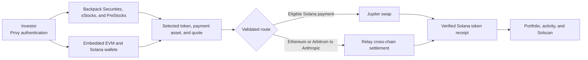

<p align="center">
  <strong style="font-size: 18px;">Eleven Capital:</strong>
  <span style="font-size: 18px;">Onchain stocks across networks, designed for Seeker</span>
</p>

<p align="center">
  
</p>

<p align="center">
  
  
  
  
</p>

Eleven Capital lets people explore tokenized U.S. stocks, ETFs, and private-company exposure from one mobile app. Instead of starting with a bridge, a token address, or a trading venue, an investor starts with the company they want to follow.

Onchain investing can make a simple decision feel complicated. Funds may be on an EVM network while the security token is on Solana. Listings from different issuers have different terms, and a stock's share price is not always the price of its tokenized counterpart. Moving between wallets, explorers, and swap interfaces leaves users to assemble the transaction for themselves.

Eleven Capital brings the pieces into one journey. Privy connects an embedded EVM wallet and a Solana wallet to the same account. The Stocks page brings Backpack Securities, xStocks, and PreStocks into one catalog. For an admitted order, the app shows the selected payment asset and network, obtains a route, requests wallet authorization, and follows the result through to the Solana wallet.

The backend uses Jupiter for eligible Solana swaps and Relay for a validated Anthropic route paid from Ethereum or Arbitrum. It checks the exact token and receiving wallet rather than treating a quote or source-chain payment as proof of ownership. Portfolio and activity then show the resulting wallet state and transaction evidence.

Explore Eleven Capital at [elevencapital.vercel.app](https://elevencapital.vercel.app).

Designed for Solana Seeker.

## How Eleven Capital uses Privy

Privy handles sign-in, the embedded wallets, and signing. Each account can have an EVM wallet and a separate Solana wallet. Eleven Capital receives public addresses and an authenticated session to prepare wallet actions; it does not hold the user's private keys.

The EVM address works across supported EVM networks, but balances remain separate on each chain. ETH on Ethereum is not ETH on Arbitrum, even when both use the same address. The Solana wallet has its own address for SOL and Solana tokens. The Add screen shows the address and network to use when receiving funds.

A wallet session is shared across Home, Stocks, Portfolio, and the order flow. Before a transfer or purchase, Eleven Capital binds the action to the account, selected network, amount, and destination. After submission, the app retains the transaction identity so it can check the same action again if the connection or app session is interrupted.

Android's device credential guards access when the app is reopened. Privy remains responsible for wallet credentials and signing material. Server-side market and transaction services never need a recovery phrase or private key.

<p align="center">
  <!-- Add the wallet and receive screenshots here.
  
  -->
</p>

<p align="center">
  <!-- Add another Privy wallet screenshot here if needed.
  
  -->
</p>

## How Eleven Capital works



The catalog preserves each asset's provider, network, and token identity. A ticker or company logo is not enough to authorize a trade. The backend checks that the quote is for the selected asset and wallet, that the payment network is supported for that order, and that the proposed transaction stays within its amount and fee limits.

For a Solana payment, Jupiter finds the swap route. Native SOL is represented as wrapped SOL inside the transaction; the user does not need to wrap it manually. Eleven Capital checks the transaction's programs, accounts, input, minimum output, and recipient before it reaches Privy for signing.

For the admitted Anthropic cross-chain route, Relay provides the existing liquidity and settlement contracts. The investor authorizes a source payment on Ethereum or Arbitrum, and the route delivers the specified Anthropic token to the connected Solana wallet. Eleven Capital does not run its own bridge. A source-chain deposit and a Solana delivery are separate events, so the order remains in progress until its destination receipt can be checked.

The app uses a route only when the specific asset pair, network, liquidity, gas requirement, and transaction validation allow it. The engineering details of deposits, provider commitments, refunds, and receipt checks are in [Smart contracts and cross-chain trading](SMART_CONTRACTS.md).

<p align="center">
  <!-- Add the stock catalog and purchase screenshots here.
  
  -->
</p>

## Transaction verification and settlement

A purchase is not complete because someone tapped Purchase, saw a success animation, or received a provider status. Eleven Capital records the reviewed order, the wallet action, and the resulting transaction identifiers. The backend checks the source-chain action and the required Solana token credit before it records completion.

The same-chain path validates the signed Solana swap and checks the received mint and amount. The cross-chain path follows the source payment, Relay route, and destination receipt. A completed order links to its actual Solana transaction signature so the onchain transfer can be opened on Solscan. An unavailable, expired, or mismatched route is not treated as a successful investment.

Market charts provide context; the executable quote determines the actual trade terms. Backpack Securities, xStocks, and PreStocks describe different legal and economic products. A token balance proves ownership of that token on Solana, while issuer documentation defines any backing, redemption, or shareholder rights.

<p align="center">
  <!-- Add a transaction or architecture image here.
  
  -->
</p>

## Wallet activity and portfolio

Home brings wallet actions together: incoming transfers, outgoing transfers, stock purchases, and sales. A row can show its time, direction, asset, and dollar value when reliable pricing is available. Portfolio shows supported holdings with their token quantity and estimated value. A missing price remains distinct from a zero balance.

Balances come from the connected wallet addresses and their chains. Pending orders remain separate from holdings until the destination receipt is verified. Explorer links are formed from validated chain and transaction identifiers rather than arbitrary URLs supplied by a quote provider.

Stocks combines issuer lists, search, charts, and order entry. Signal displays reported congressional disclosures and related news, with source links so a filing can be read independently.

<p align="center">
  <!-- Add the portfolio and activity screenshots here.
  
  -->
</p>

## Order recovery and resilience

The purchase journal separates a user's intent from each network action. Once a transaction is submitted, the app retains its identity and resumes checking its status after an interruption. A retry of status verification does not authorize another payment.

The backend rejects mismatched wallets, expired quotes, unsupported routes, duplicate submissions, and receipts for the wrong token or amount. An unresolved source payment is not assumed to have failed merely because a network request timed out. Cross-chain orders need this distinction because a confirmed deposit cannot be rolled back by a failure on the destination chain.

## Run locally

Eleven Capital needs Node.js 22.14 or newer within Node 22, npm, Java 17, Android SDK 35, and an Android device or emulator. Configure a Privy application for the Android package and sign-in redirect scheme.

Start the backend:

```bash
cd backend
npm ci
npm run dev
```

The development API listens on `127.0.0.1:8787`. In the repository root, place your Android SDK path and public Privy app and client identifiers in untracked `local.properties`, or pass the identifiers through Gradle properties or environment variables. Then build the app:

```bash
./gradlew -PandroidBuild=true -PmarketDataUrl=http://127.0.0.1:8787 :app:assembleDebug
adb reverse tcp:8787 tcp:8787
```

The loopback backend URL is for local device testing through ADB. APK packaging requires a backend URL; a deployed build needs HTTPS. `app/build.gradle.kts` rejects an ordinary HTTP endpoint outside loopback.

## Configuration

Public Privy identifiers may be supplied as `privyAppId` and `privyClientId` Gradle properties, `PRIVY_APP_ID` and `PRIVY_CLIENT_ID` environment variables, or values in untracked `local.properties`. The Android app must not contain a Privy app secret or a trading-provider API key.

The backend reads `JUPITER_API_KEY`, `RELAY_API_KEY`, and `LIFI_API_KEY` when the relevant provider requires them. It can load a Jupiter key from an owner-only local file; [server-config.ts](backend/src/server-config.ts) defines the permission and format checks. Keep keys, wallet material, local properties, APKs, and build output outside Git.

## Useful commands

```bash
cd backend && npm run dev     # Start the local API and market feed
cd backend && npm run build   # Type-check and bundle the backend
cd backend && npm test        # Run backend tests
./gradlew :core:test          # Run shared domain tests
./gradlew -PandroidBuild=true :app:compileDebugKotlin
```

The Android source lives in `ElevenApp.kt`, `auth/`, `data/`, `purchase/`, `screens/`, `ui/`, and `wallet/`. Backend routes and validation live in `backend/src/`; their tests live in `backend/test/`. The detailed contract and settlement model remains in [SMART_CONTRACTS.md](SMART_CONTRACTS.md).

## Security and current scope

Executable routes are limited to independently validated same-chain Solana swaps and the pinned Anthropic Relay route funded with ETH on Ethereum, or ETH or USDC on Arbitrum. A catalog listing or a fallback quote is not permission to trade on every network. Availability still depends on the connected wallet, amount, gas, liquidity, and provider response. A funded Anthropic purchase has not yet been rehearsed end to end on mainnet.

Debug builds include local SPCXx and Nike purchase flows for reviewing the mobile interface. They do not broadcast a new purchase or change the Privy balance; their explorer links open earlier transactions. These flows are separate from the live purchase coordinator and are disabled outside debug builds.

Tokenized securities have issuer-specific eligibility and legal terms. Review the issuer's documentation and the live order before funding a wallet or authorizing a trade.
