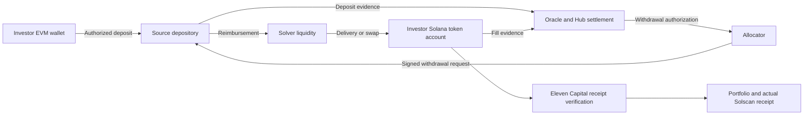
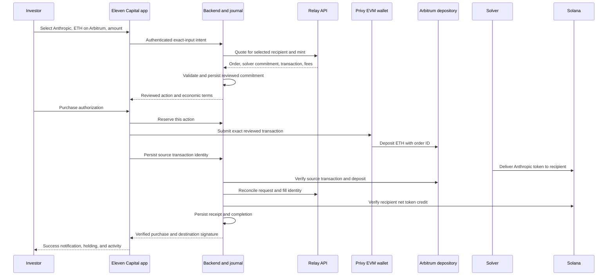

# Smart contracts and cross-chain trading

Relay provides the default cross-chain settlement infrastructure. Jupiter routes eligible same-chain Solana trades. Eleven Capital connects these services through wallet authorization, transaction validation, durable order tracking, and receipt verification. Provider contracts retain their own ownership and security model.

- [1. The investment and settlement model](#1-the-investment-and-settlement-model)
- [2. Components and trust boundaries](#2-components-and-trust-boundaries)
- [3. Network and asset registry](#3-network-and-asset-registry)
- [4. Order structure and cryptographic commitments](#4-order-structure-and-cryptographic-commitments)
- [5. Amounts, prices, slippage, and fees](#5-amounts-prices-slippage-and-fees)
- [6. EVM deposit contracts and source authorization](#6-evm-deposit-contracts-and-source-authorization)
- [7. Solana fulfillment and trading programs](#7-solana-fulfillment-and-trading-programs)
- [8. Oracle, Hub, and allocator settlement](#8-oracle-hub-and-allocator-settlement)
- [9. End-to-end Anthropic purchase](#9-end-to-end-anthropic-purchase)
- [10. Transaction and receipt verification](#10-transaction-and-receipt-verification)
- [11. Order state, retries, and persistence](#11-order-state-retries-and-persistence)
- [12. Refunds and interrupted routes](#12-refunds-and-interrupted-routes)
- [13. How contract integrations are written and built](#13-how-contract-integrations-are-written-and-built)
- [14. Operational controls and security](#14-operational-controls-and-security)
- [15. Portfolio, activity, and explorer evidence](#15-portfolio-activity-and-explorer-evidence)
- [16. Route validation and code structure](#16-route-validation-and-code-structure)

## 1. The investment and settlement model

Consider an investor buying Anthropic PreStocks with ETH held on Arbitrum One. There are three distinct assets or claims in this journey:

| Item | Meaning |
| --- | --- |
| Source ETH | The investor's payment asset on Arbitrum. It also supplies gas for the source transaction. |
| Bridge settlement balance | The provider's accounting for value deposited and delivered across networks. |
| Anthropic PreStocks token | The specific issuer token delivered to the investor's Solana wallet. |

The source ETH does not become a company share through a Solidity call. It pays for a destination delivery obligation. The solver supplies the destination token from inventory or obtains it through available liquidity. The issuer's instrument defines backing, eligibility, redemption, and economic rights.

Eleven Capital binds the purchase to the exact issuer, network, and mint. A ticker, company logo, or ordinary share-price feed is insufficient to identify the asset being purchased. Delivery of a token proves a chain-level receipt; it does not independently prove an issuer's reserves or legal equity rights.

### Two related settlement tracks

**The investor track:** authorize a source payment, observe destination delivery, verify the received token, and update the investment record.

**The provider track:** establish the source deposit, attest the destination fill, update solver balances, and authorize reimbursement from a depository.

Relay describes a liquidity model in which solvers fund destination execution with their own capital. Its protocol then accounts for deposits and fills separately. This allows delivery to precede the solver's withdrawal of reimbursement. [Relay protocol overview](https://docs.relay.link/references/protocol/how-it-works).



A Solana transaction can be atomic within Solana. The entire source-to-destination purchase is **asynchronous across chains**. Destination failure cannot roll back a confirmed EVM deposit. Recovery is therefore part of the core transaction design.

## 2. Components and trust boundaries

| Component | Responsibility | Authority boundary |
| --- | --- | --- |
| Android application | Order entry, wallet session, progress, and account presentation | Cannot declare a trade complete from an animation or timer. |
| Privy embedded wallets | Authenticate and authorize operations with the user's EVM and Solana keys | Eleven Capital's backend does not receive private keys. |
| Eleven Capital API | Validate requests, select supported routes, and construct reviewed actions | A provider quote is untrusted input until independently checked. |
| Purchase journal | Persist commitments, action reservations, transaction identities, and evidence | A retry must reconcile the same economic intent. |
| Relay source depository | Accept deposits and execute authorized withdrawals | Provider-controlled contract and allocator policy govern deposited funds. |
| Solver | Satisfy the destination delivery terms using liquidity | A solver's status report is not sufficient receipt evidence. |
| Solana token and DEX programs | Move tokens and execute supported swap instructions | Account ownership, program identity, and minimum output must be checked. |
| Relay oracle, Hub, allocator | Attest events, account for balances, and authorize withdrawals | Oracle and allocator configuration are explicit provider trust dependencies. |
| Chain RPC services | Supply transaction and account observations | Responses require chain-identity and consistency checks. |
| Issuer | Define and administer the security instrument | Trading infrastructure does not establish or alter issuer rights. |

An application login, a wallet signature, a provider commitment, and a chain receipt answer different questions. Authentication identifies the account; a signature authorizes an action; the quote commits to terms; the receipt establishes what executed. None substitutes for the others.

## 3. Network and asset registry

Every executable route references a versioned registry entry. Network membership in the product is separate from admission of a particular asset pair.

| Network | Wallet and execution model | Adapter requirement |
| --- | --- | --- |
| Ethereum | EVM wallet and EVM transactions | Verify Ethereum chain identity, token contract, depository deployment, and fee policy. |
| Base | EVM wallet and EVM transactions | Apply Base-specific RPC, deployment, confirmation, and route configuration. |
| Arbitrum | EVM wallet and EVM transactions | Identify Arbitrum One separately from Ethereum; price its transaction costs correctly. |
| Arc | EVM-compatible wallet and execution | Use Arc's native fee and asset metadata rather than inheriting ETH assumptions. |
| Monad | EVM-compatible wallet and execution | Use Monad's chain identity, native fee asset, RPC, and admitted routes. |
| Solana | Solana wallet, accounts, and programs | Verify cluster genesis, mint, token program, program deployments, and commitment policy. |

Arc's stablecoin-oriented network model and Monad's EVM environment have their own specifications. [Arc documentation](https://docs.arc.io/), [Monad documentation](https://docs.monad.xyz/).

### Registry contents

Each network record must include:

- An internal canonical identity and the corresponding provider-specific network identifiers.
- RPC endpoints, expected chain ID or genesis hash, and chain-specific finality rules.
- Native gas currency, decimals, fee estimation method, and reserved gas policy.
- Permitted depository addresses or Solana program IDs, verified deployment evidence, and permitted ABI versions.
- Contract code hashes or program build identities, with upgrade and administration metadata.
- Supported tokens identified by contract address or mint, exact decimals, and extension policy.
- Source and destination route limits, refund capabilities, minimum sizes, and enabled execution validators.

Relay uses a provider-specific numeric identifier for Solana. Eleven Capital also has an internal Solana identifier. These identifiers must be translated explicitly; neither is an EVM `eth_chainId` for Solana. The same mapping discipline applies to status responses and refund networks.

Contract identity is the tuple **network + address + deployment identity**, not an address alone. An identical hexadecimal address on two networks requires two deployment checks.

### Asset identity and eligibility

The asset registry binds a provider listing to its mint or contract. Metadata changes must not silently redirect an existing order. The backend rejects an unknown deployment even when its symbol and logo match a listed company.

Native ETH, wrapped ETH, USDC, and ARB are different payment assets. A wallet funded with ETH on Arbitrum must show **ETH · Arbitrum**. A request to spend ARB must resolve the ARB ERC-20 deployment and an executable ARB route.

A chain adapter permits execution only after quote availability, token behavior, contract identity, liquidity, costs, and receipt verification pass admission. Relay's chain and token support metadata is an input to that decision. [Relay supported-route checks](https://docs.relay.link/references/api/api_resources/supported-routes).

## 4. Order structure and cryptographic commitments

Eleven Capital maintains an internal investment intent and a provider order. The internal intent ties the trade to authentication, persistence, and presentation. The provider order expresses the cross-chain delivery and recovery terms.

### Internal intent

The following schema illustrates the application's investment intent. The Relay order has its own separately validated wire format:

```typescript
type InvestmentIntent = {
  operationId: string;
  authenticatedAccountId: string;
  side: "BUY" | "SELL";
  listingId: string;
  registryVersion: string;
  source: {
    network: string;
    wallet: string;
    asset: string;
    amountBaseUnits: string;
  };
  destination: {
    network: "solana";
    owner: string;
    asset:
      | { kind: "native"; symbol: "SOL" }
      | { kind: "token"; mint: string; tokenProgram: string };
    minimumBaseUnits: string;
  };
  quote: {
    provider: string;
    requestId: string;
    orderId: string;
    expiresAt: number;
    maximumSlippageBps: number;
    feePolicyVersion: string;
  };
};
```

Amounts are decimal strings of integers in transport and `bigint` or equivalent exact integers during computation. The authenticated account identifier stays inside the service; it is not embedded into public contract calldata.

A security purchase uses a token output. A sale can select an admitted token such as USDC or native SOL. The native/token distinction determines instruction validation, fee accounting, and receipt measurement; a display symbol alone does not establish asset identity.

An operation ID is reused only for the identical intent fingerprint. Changing the asset, amount, chain, recipient, slippage, or permitted fee requires a new reviewed commitment. The backend must resolve or verify that selected signing and destination wallets belong to the authenticated account; trusting client-supplied addresses alone does not establish that relationship.

### Provider order

The Relay adapter validates the whole accepted order shape, including:

- Protocol and order schema versions, solver identity, solver network, and salt.
- Input payment chain, currency, integer amount, and weight.
- Output chain, recipient, mint, expected amount, minimum amount, and deadline.
- Output calls, extra data, and fees; unsupported actions must be absent.
- Refund alternatives with chain, recipient, currency, minimum amount, deadline, and permitted extra data.

The adapter in [relay.ts](backend/src/relay.ts) uses the settlement SDK's `getOrderId`. In the inspected SDK version, this produces a normalized EIP-712 **struct hash**. The recovered solver commitment uses EIP-191 personal-message signing over the raw 32-byte identifier. This is distinct from an EIP-712 domain-separated withdrawal signature and distinct from signing the textual hexadecimal representation.

The normalization handles EVM and Solana address encodings. Eleven Capital must not replace it with a hash of JSON text: key order, string normalization, type widths, or VM encoding would change the commitment.

```typescript
// Integration pseudocode: use the admitted SDK and schema versions.
const order = parseSupportedProviderOrder(response.protocol.order);
validateEconomicTerms(order, reviewedIntent, registry);
validateRefundTerms(order, reviewedIntent, refundPolicy);

const computedId = getOrderId(order, providerVmTypes);
requireEqual(computedId, response.protocol.orderId);
requireEqual(
  await recoverOrderSignerFromRawId(computedId, response.protocol.signature),
  registry.permittedSolver,
);
```

The application must keep four separate identifiers: its operation ID, the provider request ID, the provider order commitment, and each blockchain transaction ID. A provider request ID is not an authorization signature. A deposit order ID is not automatically an onchain duplicate-deposit guard.

## 5. Amounts, prices, slippage, and fees

### Integer accounting

The authoritative spend and receipt are base-unit integers. If an asset has `d` decimals, a human amount maps to integer units using its admitted rounding policy. User input containing more precision than the asset supports is rejected or explicitly rounded before authorization.

Trade input must be positive, and output must satisfy `expected ≥ minimum > 0`. Values must fit the accepted ABI or program integer widths, including `uint256` where used by EVM contracts and `u64` where used by Solana instructions. Intermediate calculations use checked arithmetic or arbitrary-precision integers. A tiny order whose slippage calculation rounds the minimum to zero is rejected. Refund minima follow a separate explicit recovery policy.

Dollar entry uses a timestamped conversion to obtain the source quantity. The executable quote then determines the received token amount. Chart prices and portfolio valuations do not override a signed order.

For expected output `E` and slippage limit `s` basis points, a conventional lower bound is:

```text
minimumOutput = floor(E × (10,000 − s) / 10,000)
```

The adapter must apply its provider's exact semantics and accepted rounding tolerance. For example, `E = 1,000,000` units and `s = 50` imply a lower bound of `995,000` units. The calculation operates on token units, not a dollar approximation.

### Cost model

| Cost | Accounting requirement |
| --- | --- |
| Investment input | Exact amount authorized for the route. |
| Source gas | Reserved separately when the input is the native gas token. |
| ERC-20 approval gas | Included when a separate allowance transaction is required. |
| Bridge or solver charge | Taken from the provider quote and checked against policy. |
| Destination execution | Identify whether included in the quote or paid separately. |
| DEX and platform fees | Validate their effect on minimum receipt and authorized spend. |
| Solana account creation | Account for retained rent and the actual payer. |

For a native-asset route, the spendability condition is:

```text
availableNative ≥ routeInput + maximumSourceTransactionCost + reserve
```

Chain-specific costs, including applicable rollup data fees, belong in the cost calculation. Gas limits and fee rates require independent caps. An ERC-20 balance does not pay native gas unless a specifically admitted sponsorship mechanism covers it.

Eleven Capital must reject a small purchase that cannot satisfy minimum output and costs. A one-dollar input does not guarantee one dollar of security exposure. UI totals must distinguish payment, fees, and received value without adding fees twice.

## 6. EVM deposit contracts and source authorization

### Contract interface

Eleven Capital binds to the provider's published deposit ABI. The accepted functions represented in the backend are:

```solidity
interface IRelayDeposit {
    function depositNative(address depositor, bytes32 id) external payable;

    function depositErc20(
        address depositor,
        address token,
        uint256 amount,
        bytes32 id
    ) external;
}
```

This is an integration interface. The deployed implementation belongs to Relay. Its native entry point accepts value; its explicit-amount ERC-20 entry point transfers tokens into the depository. Relay also documents an allowance-consuming overload, which Eleven Capital's explicit-amount policy excludes. [EVM depository reference](https://docs.relay.link/references/protocol/contracts/evm-depository).

### Native ETH path

The reviewed transaction must bind:

```text
chainId       = selected source network
from          = authenticated source wallet
to            = admitted depository on that network
value         = exact input in native base units
function      = depositNative
depositor     = reviewed source wallet
id            = independently recomputed provider order ID
```

The sender needs enough native balance for both `value` and transaction costs. The application rejects an unexpected target, additional value transfer, empty order identifier, mismatched depositor, or additional action.

### ERC-20 path

The service first reads allowance for the exact tuple `(owner, token, spender, chain)`. An insufficient allowance requires an exact-amount approval to the admitted depository. The approval target is the token contract; the approval spender is the depository. These are different addresses and must not be interchanged.

After approval submission, the service verifies its successful receipt and reads the resulting allowance before authorizing a deposit. Some admitted tokens require a zero-reset sequence when replacing a nonzero allowance; that behavior needs an explicit token policy and separate reviewed actions.

The deposit uses the selected token, the exact input amount, the reviewed depositor, zero native value, and the verified order ID. Unlimited approvals, approval of unrelated spenders, and provider-injected permit signatures are outside this route's accepted action set.

Fee-on-transfer, rebasing, callback-enabled, and other nonstandard assets require a token-specific accounting policy. Without one, the adapter rejects the asset. A nominal transfer argument alone does not establish the amount credited into escrow.

### Calldata validation

The validator must parse the transaction using the admitted ABI and re-encode the decoded arguments. It accepts only an exact byte match. This rejects unexpected selectors, overloads, noncanonical encoding, and trailing data.

```typescript
// Integration pseudocode: every assertion runs before wallet authorization.
function validateDeposit(action, intent, deployment, committedOrderId) {
  assertChainAndSender(action, intent.source);
  assertEqual(action.to, deployment.depository);
  const decoded = decodeWithAdmittedAbi(action.data);
  assertEqual(encodeWithAdmittedAbi(decoded), action.data);
  assertEqual(decoded.depositor, intent.source.wallet);
  assertEqual(decoded.id, committedOrderId);
  assertExactAssetAndAmount(decoded, action.value, intent.source);
  assertGasAndFeeBounds(action, deployment.feePolicy);
}
```

### Withdrawal authority

Relay documents an allocator-authorized execution function with expiry and replay checks, and an owner-controlled allocator setting. Its withdrawal requests contain calls, a nonce, and expiration, with EIP-712 hashing. [EVM withdrawal interface](https://docs.relay.link/references/protocol/contracts/evm-depository).

An immutable contract can still depend on mutable administrator-controlled signing authority. The app must not describe expiry of its quote as a public refund method on the depository.

## 7. Solana fulfillment and trading programs

### Receiving a security token

The user's Solana address is the owner identity. The holding itself resides in a token account for the selected mint. An associated token account provides a deterministic account for the owner, mint, and token program. The token account's owning program and its stored token authority are separate concepts. [Solana token-account model](https://solana.com/docs/tokens/basics/create-token-account).

The destination validator must establish:

- The mint is exactly the admitted security deployment.
- Its token program and decimals match the registry and onchain account data.
- The recipient token account belongs to the reviewed wallet and selected mint.
- Any account creation uses the expected derivation and payer.
- The net received amount, after applicable transfer behavior, meets the committed minimum.

A solver can deliver tokens it already holds or source them through a swap. Eleven Capital verifies the committed delivery and route evidence without assuming that every Relay fill invokes Eleven Capital's own Jupiter adapter.

### Same-chain buy and sell through Jupiter

For a Solana-funded purchase, the user's wallet signs a swap transaction. For a sale, the source and destination assets reverse according to the requested trade. Jupiter constructs a route; Eleven Capital validates the returned transaction before signing. [Jupiter Swap API](https://developers.jup.ag/docs/swap).

The Solana transaction contains a fee payer, account keys, a recent blockhash, instructions, and signatures. A versioned message can refer to address lookup tables. The validator must resolve those tables using a consistent RPC context before evaluating account permissions.

The accepted instruction set is deliberately narrow: reviewed swap instruction variants, bounded compute-budget settings, necessary token-account creation, and the exact native-SOL wrapping lifecycle when required. Unknown programs, extra signers, unrelated transfers, arbitrary approvals, authority changes, and unrelated account closures fail validation.

Top-level instruction filtering is only one layer. A DEX program can invoke another program through CPI. Route decoding, permitted venue configuration, account constraints, and deployment review must address that transitive execution.

### Native SOL and wrapped SOL

Native SOL is accounted for in lamports. SPL-compatible swaps can use wrapped SOL in a token account. Wrapping, synchronization, and closing that account must be validated as one lifecycle.

A closing account can return rent as well as wrapped principal. Neither rent returned from an old account nor the wallet's pre-existing wrapped balance counts as newly purchased output. Receipt accounting separates swap proceeds, transaction fees, retained rent, and released rent.

### Token extensions

Token-2022 assets require explicit extension policy. Transfer fees can reduce credited units. Scaled UI amounts can change display quantities without changing raw stored units. Transfer hooks introduce additional program execution. Freeze and transfer restrictions can affect usability after receipt.

Each accepted extension must have documented semantics and decoder coverage. Recognizing an extension number is not equivalent to validating its behavior. Unsupported combinations fail closed, and scaling changes that invalidate quote arithmetic require a new quote.

### Message integrity

If a blockhash expires, replacing it changes the signed message. The application must revalidate and obtain the necessary authorization for the replacement. It cannot patch an already signed transaction.

The submitted signed message must match the reviewed message byte for byte.

### Relay's Solana depository

Relay also publishes an Anchor/Rust depository program with native and token deposits, allocator-authorized transfers, a configuration PDA, a vault, and replay-tracking accounts. Its transfer request is chain-specific rather than Solidity calldata. [SVM depository reference](https://docs.relay.link/references/protocol/contracts/solana-depository).

This provider component matters for routes that actually use a Solana depository. An EVM-to-Solana security delivery must not be described as requiring a user deposit into that program when its admitted route instead delivers tokens directly to the user's token account.

## 8. Oracle, Hub, and allocator settlement

### Oracle: establish witnessed events

Relay's oracle service observes chain events and produces signed attestations. Its onchain verifier checks an authorized signer and processes the associated Hub action once. A configured signer can itself be a contract implementing threshold authorization; the verifier does not inherently imply a particular multisignature threshold. [Relay oracle](https://docs.relay.link/references/protocol/components/oracle).

Eleven Capital records this trust boundary explicitly. A valid oracle signature proves authorization by that signer; it is not automatically a trustless light-client proof of both networks. The integration must track the admitted oracle configuration and distinguish provider attestation from its own RPC receipt checks.

### Hub: account for settlement balances

Relay's Hub represents deposited chain/asset combinations in an ERC-6909 ledger. Attested deposits establish balances; fills transfer settlement balances toward the solver; completed withdrawals remove the corresponding representation. Its order and withdrawal aliases are deterministic protocol constructs. They must be derived by the supported SDK rather than guessed from an order ID alone. [Relay Hub](https://docs.relay.link/references/protocol/components/hub).

The Hub representation is provider settlement accounting. It is not the security token displayed in Eleven Capital Portfolio, and it does not mint Anthropic exposure.

### Allocator: authorize reimbursement

Relay's allocator workflow connects authorized withdrawal requests to chain-specific signatures. Its documented infrastructure includes a spender gateway, MPC signing, and payload builders for EVM and Solana. Depositories verify the applicable signed request before transferring funds. Governance can affect withdrawal authorization and availability. [Relay allocator](https://docs.relay.link/references/protocol/components/allocator).

The investor's wallet key and the provider's allocator authority are unrelated keys with different roles. Privy authorizes the investor's source action; the allocator authorizes provider depository withdrawals. Eleven Capital does not require either provider signing secrets or user private keys in its API service.

### Security boundary

The solver, oracle, Hub, allocator, and depository form a dependency chain. Incorrect attestations, compromised authorization, unavailable liquidity, or halted withdrawals can affect outcomes. Administrative and upgrade powers must be part of route admission, monitoring, and incident response. Relay publishes its component trust model and external reports in its [security documentation](https://docs.relay.link/references/protocol/security).

An upstream audit applies to its documented code revision and scope. It is not an audit of Eleven Capital's adapters, wallet integration, configuration, or complete purchase journey.

## 9. End-to-end Anthropic purchase

The example uses **native ETH on Arbitrum One** as payment and the admitted **Anthropic PreStocks mint on Solana** as output.



1. The backend resolves the signed-in account's EVM and Solana wallets and checks the specific route's admission policy.
2. It reads source balance, native fees, destination mint identity, and quote inputs using timestamped observations.
3. It requests an exact-input route with the user's addresses and exact output mint. Intermediate assets remain part of the provider route rather than manual user steps.
4. It validates the signed provider commitment, economic limits, refund alternatives, and exact deposit action.
5. It durably commits the order before the wallet can broadcast. Purchase authorization covers the reviewed terms; changed terms require renewed review.
6. The wallet submits the source transaction. A lost response causes reconciliation, not another deposit.
7. The solver supplies the Solana token. The service independently verifies source execution and destination receipt.
8. The application records the actual output quantity and chain signature, refreshes balances, and shows success only after its completion policy is met.

A quoted source value of one dollar remains subject to actual gas and route costs. The app must show a spendable amount derived from the live source balance instead of promising that a fixed funding amount always suffices.

### Stablecoin settlement followed by a Solana purchase

When an admitted provider cannot quote direct security delivery, a staged route separates funding from trading:

```text
Source asset
  → validated provider transfer into Solana stablecoin
  → verified stablecoin receipt in the user's Solana wallet
  → independently quoted and authorized Solana swap
  → verified security receipt
```

The first leg commits to stablecoin delivery. It cannot promise a fixed security quantity unless an admitted mechanism separately guarantees that outcome. The second leg uses the actual received stablecoin amount, a fresh security quote, its own minimum output, and sufficient Solana transaction funding.

Eleven Capital journals both legs under one investment operation, with distinct commitments and receipts. The second leg cannot begin from a provider status alone: the stablecoin receipt must be verified. If the security swap cannot complete, the stablecoin remains a real holding requiring an explicit retry or recovery decision. The source bridge must not run again.

An EVM signature does not authorize a Solana-wallet debit. A staged flow therefore requires Solana wallet authorization or an explicitly approved, narrowly scoped delegation supported by the wallet infrastructure. Any delegation must constrain assets, amounts, permitted programs, recipient, and expiry. The backend cannot gain unrestricted signing authority merely to make the interface appear to use one click.

The route accounts for both legs' fees and price movement. Direct token delivery remains preferable when admitted because its commitment names the investment output itself. A staged path requires separate authorization, funding, recovery, and receipt checks for each leg.

## 10. Transaction and receipt verification

### Source evidence

Before accepting a source payment as the order's deposit, the service must verify:

1. RPC chain identity matches the selected network.
2. The transaction hash identifies the exact submitted action or a valid replacement of that action.
3. The actual transaction sender, destination, value, and calldata match the reviewed commitment.
4. The receipt reports successful execution and satisfies the chain's confirmation policy.
5. The relevant depository event or admitted accounting evidence identifies the expected depositor, asset, amount, and order.
6. Any preceding approval is confirmed and scoped to the reviewed token and spender.

A successful receipt for an unrelated transaction is insufficient. An EVM replacement must preserve the source chain, sender, and nonce, as well as the reviewed economic action. Gas repricing stays within the authorized fee budget; every replacement hash is reconciled against that nonce. Changing the recipient, deposit amount, or calldata cannot be treated as an equivalent replacement. Identical deposit calldata submitted with a new nonce is another payment, not a retry.

### Destination evidence

The service verifies Solana cluster identity, signature, transaction metadata, success status, mint, recipient, and minimum net credit. Solana's transaction RPC exposes execution metadata and token-balance observations; its commitment setting determines the level of confirmation being requested. [Solana transaction RPC](https://solana.com/docs/rpc/http/gettransaction).

For selected mint `m` and recipient `r`, receipt accounting uses all relevant token accounts:

```text
receivedBaseUnits =
    sum(post balances belonging to r for m)
  − sum(pre balances belonging to r for m)

accepted receipt requires receivedBaseUnits ≥ committedMinimum
```

The account set is the union of pre- and post-transaction accounts. Newly created accounts contribute zero pre-balance; closed accounts contribute zero post-balance. Missing ownership data must be resolved from transaction context or consistent account evidence, not guessed.

This avoids counting a transfer between two of the user's own accounts as newly received stock. The service also prevents reuse of the same credited output to complete different orders, identifies unrelated simultaneous credits, and requires a route-specific association between the source order and destination fill.

For provider-delivered routes, that association must name its evidence level: provider correlation plus independently checked chain receipts, or a stronger verifiable order-specific event/attestation when the admitted protocol supplies one. An RPC balance increase alone is not a cryptographic proof of cross-chain causation.

### Confirmation and finality

The completion policy is explicit per route. It records source block identity, destination slot, observation time, and required confirmation levels. A Solana `confirmed` observation and a `finalized` observation are different states. Likewise, rollup transaction acceptance and settlement on the underlying chain are different assurances.

Missing RPC data stays pending. A temporary RPC failure does not mean a transaction failed, and a provider's success status cannot override a missing or contradictory destination receipt. Reorg monitoring must preserve evidence and expose a recovery state if an accepted observation is invalidated.

## 11. Order state, retries, and persistence

The following is the logical lifecycle. Implementations can group states internally, but must preserve their distinct evidence and permissions.

| State | Evidence and permitted next step |
| --- | --- |
| Quoted | Validated terms with expiry; no payment authorized yet. |
| Committed | Immutable terms durably stored and user authorization recorded. |
| Signing | One wallet action reserved; no competing submission permitted. |
| Source submitted | Hash or wallet invocation identity saved; reconcile its outcome. |
| Source confirmed | Exact source payment verified under policy. |
| Delivery pending | Payment exists; destination fulfillment remains unresolved. |
| Receipt verified | Correct token credit established; finality policy evaluated. |
| Completed | Investment receipt and accounting recorded together. |
| Refund pending | Delivery cannot complete and the admitted recovery process is active. |
| Refunded | Actual returned asset, amount, recipient, and receipt independently verified. |
| Recovery required | Outcome or spend remains ambiguous; new spending is blocked. |
| Cancelled before submission | No payment broadcast or unresolved signing action exists. |

### Exactly-once economic intent

Network calls can run more than once; the investor's economic action must not. The journal reserves a wallet action before invoking signing and records its result before advancing.

Double taps, application restarts, repeated HTTP requests, worker retries, and duplicate webhooks must converge on the same order. A signing timeout is not evidence that the transaction was never sent. An expired quote does not release a lock on an unresolved source action.

The provider's deposit identifier cannot be assumed to reject a second deposit. Application idempotency, action reservation, wallet invocation correlation, and chain reconciliation prevent repeat spending at different layers.

### Durable storage

Persistence must succeed before a spend-capable action is exposed. Completion and receipt insertion must be committed together, with deterministic deduplication of activity records.

The repository's journal pattern uses a temporary file, flush, replacement, and directory flush for single-process durability. Horizontal workers require shared durable storage with unique constraints or transactional reservations; a local file lock is not a distributed execution guarantee.

Journal fields include immutable economic terms, registry and validator versions, provider identifiers, action fingerprints, invocation identifiers, hashes, receipts, refund evidence, and observation errors. Private keys, seed phrases, device PINs, and raw authentication tokens must never enter the journal.

## 12. Refunds and interrupted routes

Refunds are a separate economic outcome from a successful stock purchase. The order must define admissible recovery assets and networks before payment.

For each refund alternative, Eleven Capital checks the recipient, currency, minimum amount, deadline, authorized extra data, and user-visible economic effect. A source-token refund and a Solana stablecoin refund are different outcomes. Neither implies that the user receives the exact original dollar value or reimbursement of spent gas.

| Situation | Required handling |
| --- | --- |
| Quote expires before authorization | Discard it and obtain new reviewed terms. |
| Approval succeeds but deposit is not sent | Reconcile allowance; do not show a purchased stock. |
| Wallet response is lost | Recover invocation or transaction evidence before any retry. |
| Source transaction reverts | Record the failed payment and actual gas effect. |
| Source confirms but delivery is delayed | Keep the order pending and poll with bounded backoff. |
| Destination execution fails | Follow the admitted provider recovery path and retain the source evidence. |
| Provider reports a refund | Verify the refund transaction, recipient, asset, amount, and finality. |
| Provider and RPC disagree | Enter recovery; do not invent completion or refund. |
| App closes during settlement | Resume tracking from the durable journal. |

Relay documents solver-driven origin refunds as a fill-like process: funds are returned, then the oracle attests the event for settlement. That is a protocol path, not evidence that every failed quote triggers an immediate refund. [Relay refund attestation](https://docs.relay.link/references/protocol/components/oracle).

The product must not advertise an automatic timeout withdrawal unless the admitted contract and route actually expose that capability. If a recovery path requires provider coordination, the order record retains its request ID, commitment, source payment, deadlines, and escalation evidence until resolved.

Partial refunds and destination stablecoin recovery remain visible with their actual amounts. A refund status string without a verified transfer cannot increase the spendable wallet balance.

## 13. How contract integrations are written and built

### Language and ownership

The EVM boundary uses Solidity ABIs and exact ABI encoding. Relay's Solana depository uses Rust/Anchor and chain-specific account layouts. Solana swap adapters decode admitted program instructions and account state. Eleven Capital's integration and verification logic is TypeScript; Android coordination is Kotlin.

Provider contracts are consumed as pinned external dependencies. Eleven Capital's engineering work defines which versions, deployments, methods, programs, accounts, and economic behaviors it accepts. A wrapper contract is not required merely to attach an application name to a bridge call.

### Reproducible contract provenance

A contract admission package must contain:

1. Upstream repository and immutable source revision, with applicable licenses.
2. Compiler and dependency lockfiles, optimizer settings, target VM, and build options.
3. Published ABI or IDL and generated client bindings.
4. Network and deployment identity, code or program hash, and initialization parameters.
5. Owner, allocator, proxy implementation, or upgrade authority where applicable.
6. Relevant upstream audit scope and the delta between reviewed source and the admitted revision.
7. Permitted method selectors and their argument constraints.

For Solidity deployments, verification compares compiled runtime bytecode while accounting for documented metadata, linked libraries, and immutable values. Proxy-based components also require implementation and administration checks; proxy bytecode alone does not identify business logic.

For Solana programs, verification records the program ID, loader, deployed executable identity, and upgrade authority or immutability evidence. Account discriminators, instruction layouts, PDA derivation, and token-program dependencies are pinned alongside the program build.

Reproducibility establishes provenance, not absence of vulnerabilities. A compiler match and an external audit do not replace authorization review.

### Adapter construction

Adapters separate parsing, semantic validation, transaction construction, submission preparation, and receipt verification. Parsing a provider response must not grant it execution authority.

```text
provider bytes
  → strict schema parser
  → registry and economic-policy checks
  → order commitment verification
  → transaction and account validation
  → balance and fee checks
  → durable reviewed action
  → wallet authorization
  → independent chain reconciliation
```

The code path that returns an executable action must be inaccessible to quote-only adapters. Provider failover also requires a newly validated commitment; a failed bridge cannot silently be replaced with different spend instructions under an existing authorization.

Schema changes, contract upgrades, new token extensions, and new DEX layouts require explicit compatibility review. The service rejects unsupported formats instead of accepting fields it cannot interpret.

## 14. Operational controls and security

### Route controls

Execution policy limits source amount, slippage, quote age, gas, destination fees, writable accounts, and outstanding orders. A route can be paused without erasing its pending orders. Reconciliation and refund tracking continue while new source payments are disabled.

The deployment registry is versioned and access-controlled. Changes to solver identity, allocator authority, depository deployment, token mint, fee policy, or accepted programs receive review and produce a new configuration version. Existing orders retain the configuration under which they were authorized.

### Threat model

| Threat | Required defense |
| --- | --- |
| Malicious or compromised quote API | Strict schema, independent order hash, permitted signer, exact calldata, and bounded economics. |
| Client substitutes a wallet | Verified account-to-wallet binding and signed action checks. |
| RPC points to another network | EVM chain-ID and Solana genesis checks before trusting data. |
| Provider marks an unrelated fill successful | Source-action match, route correlation, recipient/mint net credit, and receipt deduplication. |
| Duplicate taps or retries | Durable operation identity, action reservation, and unresolved-spend lock. |
| Program or authority changes | Deployment/configuration monitoring and execution pause. |
| Price movement or MEV | Minimum-output constraints, short quote validity, and rejection of stale terms; no guarantee of zero MEV. |
| Token extension changes behavior | Extension-specific policy, exact units, and account checks. |
| Service outage after payment | Durable recovery worker and preserved source/provider identifiers. |
| Misleading success or refund UI | Chain-backed economic state rather than a provider label or animation. |

### Secrets and telemetry

Provider API credentials and infrastructure secrets remain server-side. Public app identifiers and public contract addresses are separate from secrets. Logs redact authorization headers, authentication tokens, signing material, and unnecessary account identity data.

Operational telemetry records quote latency, validation failures, signing duration, source confirmation, delivery delay, refund age, and reconciliation errors. Alerts focus on stuck paid orders, repeated RPC disagreement, changed deployments, and receipt-validation failures.

Explorer URLs are built from a trusted base and a validated transaction identifier. Provider-supplied arbitrary URLs must not become backend fetch targets or trusted in-app destinations.

## 15. Portfolio, activity, and explorer evidence

The confirmed chain state supplies holdings. Pending orders supply separate progress information. A locally submitted purchase does not add a spendable stock balance before receipt verification.

After completion, the service reconciles the actual source debit and destination credit, records the purchase, and refreshes Portfolio. Incoming and outgoing transfers are detected independently of purchases. Indexing lag is reconciled by stable transaction identifiers so one economic event is not counted twice.

Token quantities and dollar valuations remain separate. Missing price data does not erase a holding or invent a zero valuation. A received quantity can be established even when a reliable dollar price is unavailable.

The purchase's explorer link uses its actual verified Solana signature. If a route legitimately spans multiple destination transactions, its adapter must define the evidence set and identify the final delivery transaction. It must not silently select an arbitrary hash from an unfamiliar response.

## 16. Route validation and code structure

An executable route requires all of the following evidence:

- Verified source and destination identities, admitted asset behavior, and deployed contract/program provenance.
- Complete quote and commitment validation, including fees and acceptable recovery terms.
- Exact source authorization with account binding, gas coverage, and bounded approval scope.
- Durable idempotency and recovery through signing, submission, and receipt persistence.
- Source-transaction matching and destination net-credit verification under a named confirmation policy.
- Independent refund verification for every advertised recovery path.
- Execution records containing the actual source payment, destination receipt, fees, and confirmation levels.

Route validation spans the provider adapter, source authorization, destination delivery, and recovery. The code structure below maps those responsibilities to the corresponding components.

| Repository component | Engineering responsibility |
| --- | --- |
| [relay.ts](backend/src/relay.ts) | Relay quote parsing, order commitment, deposit validation, and status/receipt interpretation. |
| [purchase.ts](backend/src/purchase.ts) | Authenticated purchase orchestration, gas and allowance gates, action sequencing, and reconciliation. |
| [purchase-ledger.ts](backend/src/purchase-ledger.ts) | Durable intent state, action reservations, execution locks, and recovery records. |
| [solana-swap-validation.ts](backend/src/solana-swap-validation.ts) | Solana program, account, and message validation. |
| [jupiter-purchase-router.ts](backend/src/jupiter-purchase-router.ts) | Same-chain quote/execution admission and signed-message receipt verification. |
| [PurchaseCoordinator.kt](purchase/PurchaseCoordinator.kt) | Android purchase journey, wallet invocation, and resumed order tracking. |
| [auth](auth/) | Embedded wallet session and authentication integration. |

Contract interfaces, provider attestations, backend validators, wallet authorizations, and chain receipts together establish the investment flow. Eleven Capital's completion rule is precise: the reviewed input corresponds to verified receipt of the selected output asset in the selected wallet. For a purchase, that output is the admitted security token; for a sale, it is the reviewed proceeds asset, such as USDC or native SOL.
